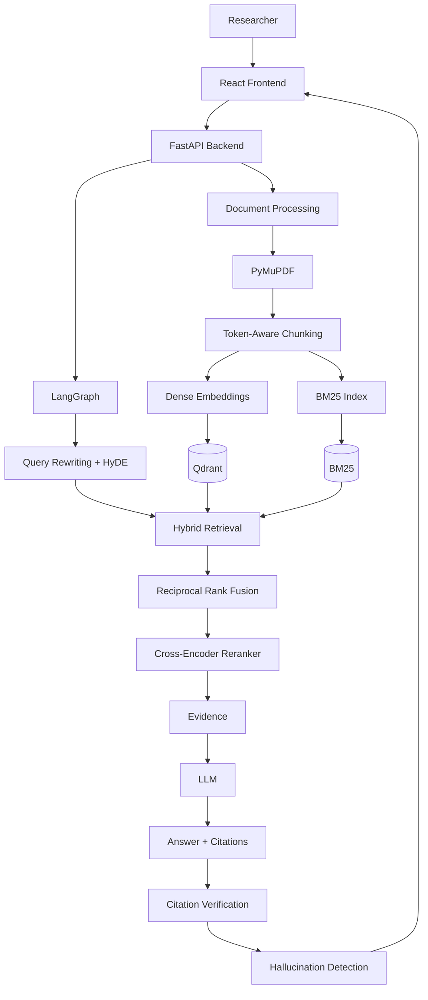

#  NexusRAG — Production-Grade Academic Research Assistant

> **Research smarter. Ask questions. Follow the evidence.**

NexusRAG is a production-grade **Retrieval-Augmented Generation (RAG)** platform for researching academic papers, technical documents, and scientific PDFs.

It goes beyond basic PDF question-answering by combining **hybrid retrieval, BM25, semantic search, Reciprocal Rank Fusion, cross-encoder reranking, query rewriting, multi-document reasoning, citation verification, and hallucination detection**.

---

##  Features

*  Multi-PDF document ingestion
*  PDF text extraction and preprocessing
*  Token-aware document chunking
*  Semantic vector search
*  BM25 lexical search
*  Hybrid retrieval with Reciprocal Rank Fusion (RRF)
*  Cross-encoder reranking
*  Query rewriting and HyDE
*  Multi-document reasoning
*  Page-level source citations
*  Citation verification
*  Hallucination detection
*  Conversation history
* Real-time SSE streaming
*  RAG evaluation and analytics
*  Interactive PDF viewer
*  Multiple LLM provider support
*  Docker support
*  Automated testing

---

#  Architecture



---

#  RAG Pipeline

NexusRAG uses a multi-stage retrieval and reasoning pipeline:

```text
PDF
 ↓
PDF Parsing
 ↓
Text Cleaning
 ↓
Token-Aware Chunking
 ↓
 ┌───────────────────┐
 │                   │
 ▼                   ▼
Dense Embeddings    BM25
 │                   │
 ▼                   ▼
Qdrant              Sparse Search
 │                   │
 └─────────┬─────────┘
           ▼
   Hybrid Retrieval
           ↓
 Reciprocal Rank Fusion
           ↓
 Cross-Encoder Reranking
           ↓
       Evidence
           ↓
   Query-Aware Reasoning
           ↓
          LLM
           ↓
 Answer + Citations
           ↓
 Citation Verification
           ↓
 Hallucination Detection
```

---

#  Document Processing

Uploaded PDFs are processed through a structured ingestion pipeline.

### Processing steps

1. Calculate SHA-256 document hash
2. Detect duplicate documents
3. Extract text using PyMuPDF
4. Normalize whitespace
5. Repair broken words caused by PDF line wrapping
6. Detect academic section headers
7. Preserve physical page boundaries
8. Split content into token-aware chunks
9. Generate embeddings
10. Index chunks in Qdrant and BM25

Each chunk maintains provenance information such as:

```text
Document ID
Filename
Page Number
Chunk Index
Section Header
Token Count
```

This allows generated answers to maintain traceability back to the original document.

---

#  Token-Aware Chunking

Documents are split using token-aware chunking.

Default configuration:

```text
Chunk Size:      500 tokens
Chunk Overlap:   100 tokens
```

Chunks do not cross physical PDF page boundaries, preserving page-level citation accuracy.

Each chunk receives a deterministic identifier:

```text
{doc_id}_p{page_number}_c{chunk_index}
```

---

#  Hybrid Retrieval

NexusRAG combines **semantic retrieval** and **lexical retrieval**.

## Dense Semantic Search

Uses:

```text
Sentence Transformers
        ↓
all-MiniLM-L6-v2
        ↓
Qdrant
        ↓
Cosine Similarity
```

## Sparse Lexical Search

Uses:

```text
Rank-BM25
    ↓
Okapi BM25
    ↓
Keyword Matching
```

This combination helps handle both:

* Conceptual questions
* Exact technical terminology
* Acronyms
* Names
* Mathematical terminology
* Domain-specific keywords

---

# Reciprocal Rank Fusion

Dense and sparse results are combined using **Reciprocal Rank Fusion (RRF)**.

```text
RRF(d) =
α / (k + rank_dense(d))
+
(1 - α) / (k + rank_sparse(d))
```

Default configuration:

```text
k = 60
α = 0.5
```

RRF combines the rankings without requiring dense and sparse retrieval scores to share the same scale.

---

#  Cross-Encoder Reranking

After hybrid retrieval, candidate passages are reranked using a cross-encoder.

```text
User Query
     +
Candidate Passage
     ↓
Cross-Encoder
     ↓
Relevance Score
     ↓
Top Relevant Chunks
```

NexusRAG uses **FlashRank** with an ONNX-optimized MS MARCO model for CPU-friendly reranking.

The default pipeline reduces the retrieved candidate pool to the top 5 context chunks before synthesis.

---

#  Query Rewriting & HyDE

Complex research questions can be transformed before retrieval.

### Query Rewriting

The system can:

* Analyze the user's question
* Consider conversation history
* Decompose complex questions
* Generate targeted search queries

### HyDE

**Hypothetical Document Embeddings (HyDE)** can generate a hypothetical academic passage and use it to improve semantic retrieval.

```text
Research Question
       ↓
Query Analysis
       ↓
Query Rewriting
       ↓
Optional HyDE
       ↓
Hybrid Retrieval
```

---

#  LangGraph Reasoning

LangGraph orchestrates the reasoning pipeline as a state graph.

```text
analyze_query
      ↓
retrieve_evidence
      ↓
synthesize_multidoc
      ↓
extract_citations
      ↓
verification
      ↓
END
```

The state maintains information such as:

```text
query
chat_history
doc_ids
retrieved_chunks
formatted_context
answer
citations
reasoning_steps
is_grounded
faithfulness_score
```

---

#  Multi-Document Research

Users can select multiple research papers and ask questions across them.

Example:

> Compare the methodologies used in these three research papers.

The system retrieves relevant evidence from multiple documents and synthesizes the results while maintaining document and page provenance.

---

#  Citation System

NexusRAG provides page-level citations such as:

```text
[ResearchPaper.pdf, p. 4]
```

Each citation contains:

* Document
* Page number
* Relevant evidence
* Retrieval information

Clicking a citation in the frontend can navigate directly to the corresponding PDF page.

---

#  Citation Verification

Generated citations are independently verified against the indexed document context.

The verification pipeline:

1. Extracts citations from the generated answer
2. Identifies the cited document and page
3. Checks whether the page exists in retrieved evidence
4. Compares the claim with source text
5. Calculates lexical overlap
6. Marks the citation as verified or potentially unsupported

Jaccard token overlap is used as one verification signal.

---

#  Hallucination Detection

The system evaluates generated answers at the claim level.

```text
Generated Answer
       ↓
Claim Extraction
       ↓
Individual Claims
       ↓
Evidence Comparison
       ↓
Supported / Unsupported
       ↓
Faithfulness Score
```

Example:

```text
Claim 1    ✓ Supported
Claim 2    ✓ Supported
Claim 3    ⚠ Partially Supported
Claim 4    ✗ Unsupported
```

Faithfulness is calculated as:

```text
Faithfulness =
Verified Claims / Total Claims
```

The system can flag responses with low grounding.

---

#  Frontend

The frontend is built as an interactive research workspace.

### Main screens

| Route            | Purpose                                   |
| ---------------- | ----------------------------------------- |
| `/dashboard`     | Research overview and document statistics |
| `/research`      | Multi-document research and chat          |
| `/library`       | PDF library and document management       |
| `/documents/:id` | PDF viewer and citation navigation        |
| `/collections`   | Organize papers by research topic         |
| `/history`       | Previous research sessions                |
| `/analytics`     | Retrieval and performance analytics       |
| `/evaluation`    | RAG evaluation metrics                    |
| `/verification`  | Claim-level verification                  |
| `/settings`      | Model and application configuration       |

### Research Studio

The main research interface provides:

* Document selection
* Research chat
* Streaming responses
* Interactive citations
* Source evidence
* Retrieval details
* Reranking information
* Output customization

---

#  Technology Stack

| Category             | Technology                   |
| -------------------- | ---------------------------- |
| Programming Language | Python                       |
| Backend              | FastAPI                      |
| RAG Orchestration    | LangChain, LangGraph         |
| Vector Database      | Qdrant                       |
| Embeddings           | Sentence Transformers        |
| Sparse Retrieval     | Rank-BM25                    |
| Ranking Fusion       | Reciprocal Rank Fusion       |
| Reranking            | FlashRank                    |
| PDF Processing       | PyMuPDF                      |
| Tokenization         | tiktoken                     |
| LLM Providers        | Gemini, OpenAI, Groq, Ollama |
| Frontend             | React, TypeScript            |
| Build Tool           | Vite                         |
| Styling              | Tailwind CSS                 |
| State Management     | TanStack Query               |
| Charts               | Recharts                     |
| Testing              | Pytest                       |
| Containerization     | Docker                       |
| CI/CD                | GitHub Actions               |

---

#  Project Structure

```text
rag-research-assistant/
│
├── backend/
│   ├── app/
│   │   ├── api/
│   │   ├── core/
│   │   ├── database/
│   │   ├── models/
│   │   ├── rag/
│   │   └── services/
│   │
│   ├── data/
│   │   ├── uploads/
│   │   ├── qdrant/
│   │   └── bm25/
│   │
│   ├── tests/
│   ├── requirements.txt
│   └── .env.example
│
├── frontend/
│   ├── src/
│   │   ├── components/
│   │   ├── pages/
│   │   ├── services/
│   │   ├── context/
│   │   └── types/
│   │
│   ├── package.json
│   └── vite.config.ts
│
├── docs/
├── evaluation/
├── scripts/
├── .gitignore
├── README.md
└── docker-compose.yml
```

---

# 🔌 API Endpoints

| Method   | Endpoint                      | Description                   |
| -------- | ----------------------------- | ----------------------------- |
| `GET`    | `/api/health`                 | Application health check      |
| `GET`    | `/api/documents`              | List indexed documents        |
| `POST`   | `/api/documents/upload`       | Upload and process PDFs       |
| `GET`    | `/api/documents/{doc_id}`     | Get document metadata         |
| `DELETE` | `/api/documents/{doc_id}`     | Delete a document             |
| `GET`    | `/api/documents/{doc_id}/pdf` | Retrieve the PDF              |
| `POST`   | `/api/chat`                   | Execute RAG query             |
| `POST`   | `/api/chat/stream`            | Stream RAG response using SSE |
| `GET`    | `/api/settings`               | Get application settings      |
| `POST`   | `/api/settings`               | Update application settings   |

---

#  Configuration

Create a `.env` file based on `.env.example`.

Example:

```env
LLM_PROVIDER=gemini

GEMINI_API_KEY=

OPENAI_API_KEY=
GROQ_API_KEY=

OLLAMA_BASE_URL=http://localhost:11434

EMBEDDING_MODEL=sentence-transformers/all-MiniLM-L6-v2

RERANKER_MODEL=ms-marco-MiniLM-L-6-v2

CHUNK_SIZE=500
CHUNK_OVERLAP=100

DENSE_TOP_K=15
SPARSE_TOP_K=15
RERANK_TOP_K=5

RRF_K=60
```


---

#  Installation

## 1. Clone the repository

```bash
git clone https://github.com/sreelekshmisajuk/rag-research-assistant.git

cd rag-research-assistant
```

## 2. Create Python environment

```powershell
python -m venv .venv
```

Activate:

```powershell
.\.venv\Scripts\Activate.ps1
```

## 3. Install backend dependencies

```powershell
pip install -r backend/requirements.txt
```

## 4. Configure environment variables

```powershell
copy backend\.env.example backend\.env
```

Add your LLM API key to:

```text
backend/.env
```

## 5. Install frontend dependencies

```powershell
cd frontend
npm install
```

---

#  Run Locally

## Backend

From the project root:

```powershell
cd backend

python -m uvicorn app.main:app --host 127.0.0.1 --port 8000 --reload
```

Backend:

```text
http://127.0.0.1:8000
```

API documentation:

```text
http://127.0.0.1:8000/docs
```

## Frontend

Open another terminal:

```powershell
cd frontend

npm run dev
```

Frontend:

```text
http://localhost:5173
```

---

#  Testing

Run the backend tests:

```powershell
cd backend

python -m pytest tests/ -v
```

The test suite covers areas including:

* PDF processing
* Document chunking
* BM25 retrieval
* Hybrid retrieval
* RRF ranking
* Reranking
* LangGraph state transitions
* Citation verification
* Hallucination grading
* API endpoints

---

#  Docker

Build and start the application:

```bash
docker compose up -d --build
```

Check running containers:

```bash
docker compose ps
```

Stop the application:

```bash
docker compose down
```

---

# 📊 RAG Evaluation

The project supports evaluation of the retrieval and generation pipeline using metrics such as:

* Recall@K
* Precision@K
* Mean Reciprocal Rank (MRR)
* Context Relevance
* Context Recall
* Answer Relevance
* Faithfulness
* Citation Accuracy
* Response Latency

Different retrieval configurations can be compared:

```text
Baseline
   vs
Hybrid Search
   vs
Hybrid + Reranker
```


---

# Security

* API keys are stored in environment variables.
* Secrets are never stored in frontend code.
* `.env` files are excluded from Git.
* Uploaded documents are stored locally during development.
* Configuration is separated from application code.

---

#  Roadmap

* [x] PDF ingestion
* [x] Document preprocessing
* [x] Token-aware chunking
* [x] Dense semantic retrieval
* [x] BM25 lexical retrieval
* [x] Hybrid retrieval
* [x] Reciprocal Rank Fusion
* [x] Cross-encoder reranking
* [x] Query rewriting
* [x] HyDE
* [x] Multi-document reasoning
* [x] Citation generation
* [x] Citation verification
* [x] Hallucination detection
* [x] Interactive PDF viewer
* [x] Research workspace
* [x] Analytics
* [x] Evaluation interface
* [ ] Advanced observability
* [ ] Authentication and authorization
* [ ] Cloud deployment
* [ ] Distributed vector storage

---

# 🎯 What This Project Demonstrates

NexusRAG demonstrates practical experience in:

**Machine Learning & NLP**

* Information retrieval
* Natural language processing
* Semantic embeddings
* Transformer-based models

**Generative AI**

* LLM integration
* RAG
* Query rewriting
* HyDE
* Multi-document reasoning

**AI Engineering**

* FastAPI
* LangChain
* LangGraph
* Vector databases
* Hybrid retrieval
* Reranking
* Streaming APIs

**AI Reliability**

* Citation verification
* Evidence grounding
* Hallucination detection
* RAG evaluation

**Software Engineering**

* Modular architecture
* REST APIs
* React + TypeScript
* Automated testing
* Docker
* CI/CD


